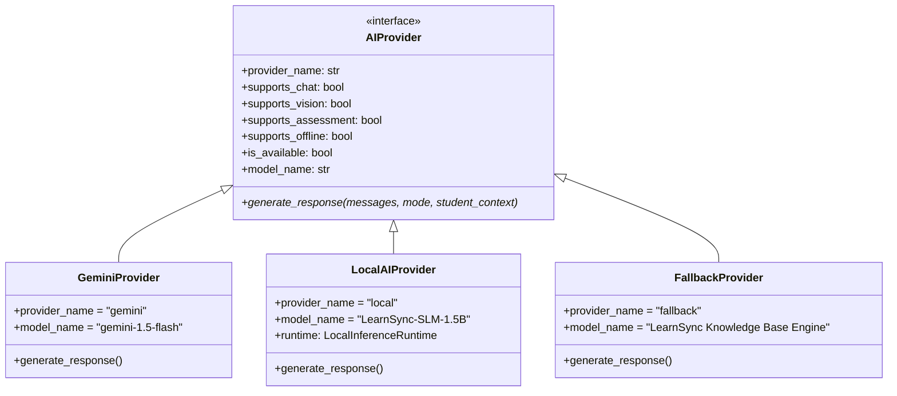
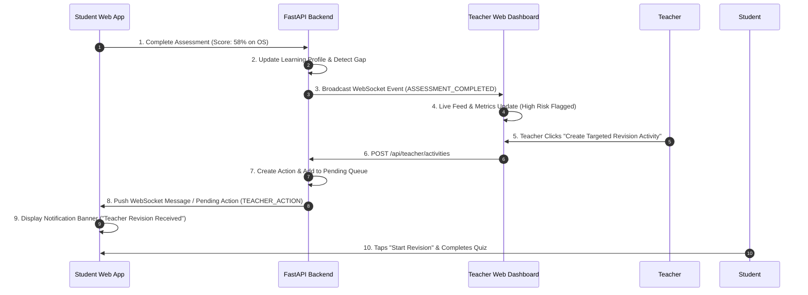

# LearnSync AI
## Connecting Every Learner to Smarter Learning

---

### 1. Project Overview

**LearnSync AI** is a general-purpose, AI-powered intelligent education web platform accessible from any desktop, laptop, tablet, or mobile browser. It connects every learner to personalized AI-powered tutoring, multimodal question solving, and adaptive assessments, while giving teachers actionable, real-time insight into classroom learning gaps and misconceptions.

#### Primary Product Vision
"Connect every learner to personalized AI-powered learning while giving teachers actionable insight into classroom learning gaps."

#### Problem Solved
Traditional classrooms suffer from a critical feedback delay: teachers often discover student learning gaps weeks after a topic is taught, usually during major exams when it is too late to remediate effectively. Meanwhile, students struggling with specific subtopics (e.g., *TCP 4-Way FIN Handshake* or *Process Scheduling Gantt Charts*) lack immediate, personalized, 24/7 guidance tailored to their current mastery level.

#### General-Purpose Web Application Experience
LearnSync AI operates as a modern web application:
- **Responsive Across Devices:** Form factors adapt automatically whether accessed from desktop monitors, laptops, tablets, or mobile phone browsers.
- **Multimodal Web Inputs:** Supports typed text, browser-supported camera capture or file uploads for image question solving, and browser speech recognition or typed fallbacks for voice queries.
- **For Students:** Immediate multimodal explanations across three explanation modes (Simple, Real-World, Technical), step-by-step mistake breakdowns, and dynamic adaptive practice.
- **For Teachers:** Automated detection of classroom-wide misconceptions and weak topics, live activity feeds showing student completions in real time, and instant dispatch of targeted revision modules.

#### One-Paragraph Executive Summary
> **LearnSync AI** is an intelligent education web platform combining a responsive student web app, a FastAPI backend with multi-provider AI routing (Gemini Cloud, Local Engine, and Deterministic Offline Engine), and a React Teacher Intelligence Dashboard. Students ask questions using text, browser voice, or file/camera uploads and take adaptive assessments from any device. The backend calculates precise topic mastery scores and detects learning gaps, automatically populating the teacher's dashboard with classroom analytics. Teachers can then send targeted revision activities directly back to student web apps over WebSockets or REST polling, completing a seamless closed-loop feedback cycle.

#### Core Learning Loop

```
LEARN → PRACTICE → ASSESS → IDENTIFY GAPS → PERSONALIZE → TEACHER ACTION → TARGETED REVISION → IMPROVE
```

#### Student Learning Loop

```
Student (Web App)
       │
       ▼
   AI Tutor
       │
       ▼
    Practice
       │
       ▼
   Assessment
       │
       ▼
 Learning Profile
       │
       ▼
Personalized Recommendation
```

#### Teacher Intelligence Loop

```
Student Data
     │
     ▼
Learning Analytics
     │
     ▼
Weak Topic Detection
     │
     ▼
Misconception Detection
     │
     ▼
Teacher Recommendation
     │
     ▼
Targeted Activity Creation
     │
     ▼
Student Web App Notification
```

---

### 2. Complete Application Flow

The following 20-step end-to-end flow illustrates how a student query or assessment travels through the web platform and closes the loop with teacher intelligence:

1. **Student Opens Web Application:** Student accesses LearnSync AI on any browser (desktop, laptop, tablet, or mobile).
2. **Student Initiates Query:** Student chooses to ask a question via text, voice, or image file/camera upload.
3. **Multimodal Input Processing:**
   - **Text:** Typed directly into the AI Tutor interface.
   - **Voice:** Audio captured via browser microphone API and transcribed (or typed input fallback).
   - **Camera / File Upload:** Problem image uploaded or captured, converted to Base64, and sent to Vision API.
4. **Request Transmitted:** Student web app sends HTTP POST request to FastAPI backend (`/api/tutor/chat` or `/api/vision/analyze`).
5. **AI Routing:** `AIRouterService` inspects configured provider mode (`AUTO`, `LOCAL`, `GEMINI`, `FALLBACK`) and selects the optimal active provider.
6. **AI Provider Execution:** Active AI provider (e.g., Gemini Cloud API or Local/Fallback Engine) generates an educational explanation based on student context and selected mode (Simple, Real-World, Technical).
7. **Explanation Delivered:** Response returns to student web app and displays with follow-up suggestions (*Quiz Me*, *Practice This Topic*).
8. **Multi-Turn Interaction:** Student asks follow-up questions or requests simplified breakdowns.
9. **Practice Initiated:** Student selects a topic or receives a recommendation to test their understanding.
10. **Adaptive Assessment Request:** Student opens Assess screen or clicks *Start Quiz*; web app calls `POST /api/assessment/generate`.
11. **Assessment Delivery & Execution:** Backend delivers structured MCQs; student answers questions with dynamic difficulty progression (Correct → Harder, Incorrect → Easier).
12. **Evaluation & Scoring:** Web app calls `POST /api/assessment/evaluate`. Backend evaluates correct/incorrect responses, calculates score percentage, and generates mistake explanations.
13. **Learning Profile Update:** `LearningProfileService` receives results and recalculates topic mastery using the explainable formula: `Mastery = min(100, round(0.6 * recent_score + 0.4 * historical_accuracy))`.
14. **Learning Gap Classification:** Subtopics are classified into `strong` (≥90%), `moderate` (60–89%), or `needs_practice` (<60%). Repeated mistakes (≥2 failures on subtopic) are flagged.
15. **Real-Time Event Broadcast:** Web app calls `CollaborationService.sendStudentEvent()`. Event is published via WebSocket (`/api/collaboration/ws/student/...`) to FastAPI. FastAPI broadcasts `ASSESSMENT_COMPLETED` or `WEAK_TOPIC_DETECTED` to all connected React Teacher Dashboards.
16. **Teacher Dashboard Update:** Teacher Dashboard receives event over WebSocket (or REST polling fallback `GET /api/collaboration/events`) and updates the Live Classroom Feed and Student Attention Table.
17. **Teacher Insight & Recommendation:** Dashboard highlights classroom-wide weak topics (e.g., *Process Scheduling: 58% class mastery, 17 students affected*).
18. **Teacher Action Creation:** Teacher clicks *Create Revision Activity* or *Start Revision Plan* for affected students (`POST /api/teacher/activities`).
19. **Real-Time Action Dispatch:** Backend creates `TeacherActionModel` and pushes `TEACHER_ACTION` notification via WebSocket to student web apps (or queues in `pending_actions` for REST polling `GET /api/collaboration/pending/{student_id}`).
20. **Student Receives & Completes Revision:** A banner pops up on student's web app screen ("*Teacher Revision Activity Received*"). Student taps *Start Revision*, completes targeted 5-question quiz, updating their Learning Profile and closing the classroom loop.

---

### 3. System Architecture

#### Web Application Component Architecture Diagram

```mermaid
graph TD
    subgraph Student Web App - Responsive Web
        A[Student Web Interface<br/>Home | Learn | Assess | Progress | Profile] --> B[Navigation Engine<br/>MainNavigationScreen]
        B --> C1[TutorService]
        B --> C2[VisionService]
        B --> C3[AssessmentService]
        B --> C4[LearningService]
        B --> C5[CollaborationService]
        B --> C6[LocalAiService]
    end

    subgraph FastAPI Backend - Python 3.12
        API1[tutor_router<br/>/api/tutor/*]
        API2[vision_router<br/>/api/vision/*]
        API3[assessment_router<br/>/api/assessment/*]
        API4[learning_router<br/>/api/learning/*]
        API5[teacher_router<br/>/api/teacher/*]
        API6[collaboration_router<br/>/api/collaboration/*]
        API7[ai_status_router<br/>/api/ai/*]

        C1 --> API1
        C2 --> API2
        C3 --> API3
        C4 --> API4
        C5 <-->|WebSocket / REST| API6

        subgraph Core Services Layer
            S1[TutorService]
            S2[VisionService]
            S3[AssessmentService]
            S4[LearningProfileService & LearningGapService]
            S5[TeacherService]
            S6[CollaborationService]
            S7[AIRouterService]
        end

        API1 --> S1
        API2 --> S2
        API3 --> S3
        API4 --> S4
        API5 --> S5
        API6 --> S6
        API7 --> S7

        S1 & S2 & S3 --> S7

        subgraph AI Provider Abstraction Matrix
            P1[LocalAIProvider<br/>LocalInferenceRuntime]
            P2[GeminiProvider / GeminiVisionProvider]
            P3[FallbackProvider / FallbackVisionProvider]
        end

        S7 -->|AUTO / LOCAL| P1
        S7 -->|GEMINI| P2
        S7 -->|FALLBACK| P3
    end

    subgraph Teacher Web App - React 18 / Vite
        R1[DashboardPage]
        R2[TopicsPage & TopicDetailPage]
        R3[StudentsPage & StudentDetailPage]
        R4[AssessmentsPage]
        R5[RecommendationsPage]
        R6[LiveClassroomFeed & ConnectionStatusHeader]

        R1 & R2 & R3 & R4 & R5 & R6 --> RAPI[teacherApi.js]
        RAPI <-->|REST API| API5
        RAPI <-->|WebSocket / REST Polling| API6
    end
```

#### Tech Stack Summary & Component Roles

| Component | Framework / Tool | Responsibilities |
| :--- | :--- | :--- |
| **Student Web App** | Flutter Web / Material 3 | Responsive student web interface, multi-tab layout, state overlay routes, WebSocket listener, browser camera / file upload. |
| **Backend API** | FastAPI (Python 3.12), Pydantic v2 | High-performance async REST API, WebSocket server, AI routing, assessment evaluation, learning profile calculations, teacher analytics. |
| **Teacher Dashboard** | React 18, Vite, Vanilla CSS | Responsive web dashboard, live classroom feed, student risk metrics, topic misconception analytics, targeted activity dispatcher. |
| **AI Routing Engine** | Custom `AIRouterService` | Multi-tier AI routing (`AUTO` → `LOCAL` → `GEMINI` → `FALLBACK`), credential shielding, AI capability status reporting. |
| **Real-Time Layer** | WebSockets + REST Polling Fallback | Two-way instant messaging between student web apps and teacher dashboard; fallback queue for network resilience. |

---

### 4. Student Web Application Experience

The Student Web Application is designed for desktop, laptop, tablet, and mobile browsers.

#### Responsive Navigation & Layout
- **Desktop / Laptop View:** Multi-column dashboard, sticky navigation, clear side/header options.
- **Tablet / Mobile View:** Compact navigation bar, touch-friendly cards, zero horizontal overflow.

#### Major Views & Functionality

#### 1. Home View
- **Header & Welcome:** Student profile summary (*Santhosh K.*, B.Tech CSE AI & ML).
- **AI Tutor Action Bar:** Quick-launch buttons for Text, Voice, and Camera/File upload queries.
- **Continue Learning:** Shortcuts to jump back into recently practiced subjects (*Computer Networks*, *Operating Systems*).
- **Today's Progress:** Dynamic progress gauge showing overall mastery percentage (78%).
- **Recommendations:** Next Best Action banner (*Revise TCP Connection Termination*).
- **Subject Overview Cards:** Cards with progress indicators and quick quiz entry points.

#### 2. Learn View
- **Subject List:** View of subjects (*Computer Networks*, *Data Structures*, *DBMS*, *Operating Systems*).
- **Topic Progress Breakdown:** Subtopic lists with status badges (`Strong`, `Moderate`, `Needs Practice`).
- **Search & Filter:** Subject filtering and keyword search across curriculum modules.

#### 3. AI Tutor Interface
- **Multi-Turn Chat Interface:** Dynamic message history with student and AI chat bubbles.
- **Explanation Mode Selector:** Toggle buttons for **Simple** (analogy-driven), **Real-World** (practical applications), and **Technical** (deep engineering specs).
- **Multimodal Web Inputs:** Text field, Voice trigger, and Camera / File upload picker.
- **Follow-up Action Chips:** Quick action buttons (*Quiz Me*, *Practice This Topic*, *New Chat*).

#### 4. Camera & Image Question Solving
```
Desktop File Upload / Mobile Browser Camera
                   │
                   ▼
             Image Preview
                   │
                   ▼
         Base64 Encoding & Upload
                   │
                   ▼
         POST /api/vision/analyze
                   │
                   ▼
     Vision OCR & Question Extraction
                   │
                   ▼
        Question Confirmation UI
                   │
                   ▼
        Launch AI Tutor with Question
```

- Supports desktop image file selection as well as mobile browser camera captures.
- Transmits to backend for OCR and metadata extraction (`question`, `topic`, `subtopic`, `confidence`).
- Presents an editable confirmation dialog so students can verify extracted text before querying the AI Tutor.

#### 5. Voice AI
- Browser-compatible speech recognition where supported.
- Displays state indicators (Listening, Processing, Transcribing).
- If browser speech API is unavailable, gracefully displays a friendly fallback prompt for typing.

#### 6. Assessment Views
- **Config View:** Select subject, topic, question count (3, 5, 10), and mode (Adaptive, Easy, Medium, Hard).
- **Question View:** Displays MCQ UI with option selection, timer, progress bar, and instant submit.
- **Result View:** Displays score percentage, strong/weak topics, mistake breakdowns, adaptive difficulty trajectory graph, and a *Practice Weak Topic* button.

#### 7. Progress & Profile Views
- Overall mastery breakdown, needs attention list, learning statistics, account settings, and AI provider status options.

---

### 5. AI Tutor Architecture

The AI engine uses an abstraction pattern ([`backend/app/providers/ai_provider.py`](file:///d:/codes/IQOO/backend/app/providers/ai_provider.py)) to decouple application logic from specific LLM providers.



#### Why Provider Abstraction Matters
- **Zero Vendor Lock-in:** The application can seamlessly switch between Gemini Cloud, local engines, or offline rule engines without modifying API routes or frontend code.
- **API Key Protection:** Credentials (`GEMINI_API_KEY`) reside exclusively in backend environment variables (`.env`). Frontend web clients never receive or store secrets.
- **Automatic Fallback:** If Gemini Cloud experiences network latency or rate-limiting, the system automatically falls back to local/deterministic engines.

#### Explanation Modes
- **Simple:** Uses plain language, high-level analogies, and avoids complex jargon.
- **Real-World:** Uses industry case studies, practical engineering examples, and real-world software applications.
- **Technical:** Uses formal definitions, mathematical proofs, code snippets, and low-level protocol specifications.

#### AI Router Decision Logic ([`backend/app/services/ai_router_service.py`](file:///d:/codes/IQOO/backend/app/services/ai_router_service.py))

```
MODE OVERRIDE / CONFIG:
├── 'local'    ──> Try LocalAIProvider ──(if unavailable)──> Gemini ──(if unavailable)──> Fallback
├── 'gemini'   ──> Try GeminiProvider  ──(if unavailable)──> Fallback
├── 'fallback' ──> FallbackProvider
└── 'auto'     ──> Try Local ──(if unavailable)──> Gemini ──(if unavailable)──> Fallback
```

#### AI Status Endpoint (`GET /api/ai/status`)
Exposes operational health and capability flags without disclosing credentials:

```json
{
  "mode": "auto",
  "active_provider": "gemini",
  "active_model": "gemini-1.5-flash",
  "local_available": false,
  "local_runtime": "Local CPU Fallback",
  "hardware_acceleration": false,
  "device_ready": false,
  "gemini_available": true,
  "fallback_available": true,
  "offline_ready": true,
  "capabilities": {
    "chat": true,
    "vision": true,
    "assessment": true,
    "offline": true
  },
  "device_info": {
    "device": "LearnSync Device Platform",
    "npu_status": "Not Detected",
    "cloud_ai": "Available"
  }
}
```

---

### 6. Vision AI Architecture

The Vision AI engine processes student-submitted problem images through a structured pipeline ([`backend/app/services/vision_service.py`](file:///d:/codes/IQOO/backend/app/services/vision_service.py)).

```
Desktop File Upload / Mobile Browser Camera
                    │
                    ▼
          Base64 Image Encoding
                    │
                    ▼
          POST /api/vision/analyze
                    │
                    ▼
              VisionService
                    │
                    ├─► GeminiVisionProvider (Cloud OCR & Vision LLM)
                    └─► FallbackVisionProvider (Deterministic Local OCR Parser)
                    │
                    ▼
     Extracted Vision Analysis Response
```

#### Extracted Response Schema (`VisionAnalyzeResponse`)
- `question`: Extracted plain-text problem or math equation.
- `topic`: Inferred subject/topic (e.g., *Computer Networks*).
- `subtopic`: Specific subtopic (e.g., *TCP Connection Termination*).
- `content_type`: Detected category (`math_equation`, `conceptual_question`, `diagram`, `code_snippet`).
- `confidence`: Extraction confidence score (0.0 to 1.0, e.g., `0.95`).
- `extracted_text`: Raw OCR text string.

---

### 7. Adaptive Assessment Engine

The assessment engine ([`backend/app/services/assessment_service.py`](file:///d:/codes/IQOO/backend/app/services/assessment_service.py)) generates targeted questions and dynamically adapts difficulty based on live performance.

```
POST /api/assessment/generate
        │
        ▼
Assessment Provider Selection (Gemini / Fallback / Local)
        │
        ▼
Generates N Multiple-Choice Questions (MCQs)
        │
        ▼
Student Submits Answers -> POST /api/assessment/evaluate
        │
        ▼
Evaluates Score & Trajectory
        │
        ▼
Updates Student Learning Profile
```

#### Adaptive Difficulty Logic
- **Starting Level:** Medium (or user-selected baseline).
- **Correct Answer:** Increases consecutive streak counter. Next question transitions to higher difficulty tier (`Easy` → `Medium` → `Hard`).
- **Incorrect Answer:** Resets streak counter. Next question transitions to lower difficulty tier (`Hard` → `Medium` → `Easy`).
- **Trajectory Tracking:** Records step-by-step difficulty transitions (e.g., `["Medium", "Hard", "Hard", "Medium", "Hard"]`) for teacher analysis.

---

### 8. Learning Profile Engine

The Learning Profile Engine ([`backend/app/services/learning_profile_service.py`](file:///d:/codes/IQOO/backend/app/services/learning_profile_service.py)) maintains an ongoing model of student knowledge across all subjects and subtopics.

#### Explainable Mastery Formula
$$\text{Mastery Score} = \min\left(100, \text{round}\left(0.6 \times \text{Recent Score} + 0.4 \times \text{Historical Accuracy}\right)\right)$$

Where:
- $\text{Recent Score}$: Percentage score on the latest assessment for that subtopic.
- $\text{Historical Accuracy}$: $\frac{\text{Total Correct Answers}}{\text{Total Attempts}} \times 100$.

#### Performance Status Classification
- **Strong:** $\text{Mastery Score} \ge 90\%$
- **Moderate:** $60\% \le \text{Mastery Score} \le 89\%$
- **Needs Practice (Weak):** $\text{Mastery Score} < 60\%$

#### Repeated Mistake & Recommendation Engine
- **Repeated Mistake Detection:** Identifies subtopics where a student has failed $\ge 2$ questions.
- **Priority System:** `HIGH` (Mastery $< 60\%$ or $\ge 2$ mistakes), `MEDIUM` (Mastery $60\%-75\%$), `LOW` (Mastery $\ge 75\%$).

---

### 9. Teacher Intelligence Dashboard

The React Teacher Dashboard ([`teacher-dashboard/src/`](file:///d:/codes/IQOO/teacher-dashboard/src/)) presents classroom performance analytics and tools for targeted instruction.

```
React Teacher Dashboard
├── Navigation Sidebar (SidebarNav.jsx)
├── Top Bar & Status (DashboardHeader.jsx, ConnectionStatusHeader.jsx)
├── Pages
│   ├── Dashboard (DashboardPage.jsx)
│   ├── Topics (TopicsPage.jsx & TopicDetailPage.jsx)
│   ├── Students (StudentsPage.jsx & StudentDetailPage.jsx)
│   ├── Assessments (AssessmentsPage.jsx)
│   ├── Recommendations (RecommendationsPage.jsx)
│   └── Profile (ProfilePage.jsx)
└── Modals & Interactive Components
    ├── ActivityModal.jsx (Create targeted revision)
    ├── LiveClassroomFeed.jsx (Real-time WebSocket event list)
    └── MisconceptionCard.jsx & TopicInsightCard.jsx
```

#### Key Dashboard Views & Capabilities
- **Main Dashboard (`DashboardPage.jsx`):** Displays class average (78%), total enrolled students (42), students needing attention, subject mastery breakdown chart, top classroom gaps, and live feed.
- **Topic Analytics (`TopicsPage.jsx` / `TopicDetailPage.jsx`):** Deep dive into specific topics (*Process Scheduling: 58% class mastery, 17 students affected*).
- **Student Roster (`StudentsPage.jsx` / `StudentDetailPage.jsx`):** Roster showing student mastery scores, trend arrows, and weak topic badges.
- **AI Recommendations (`RecommendationsPage.jsx`):** Explainable AI cards answering **WHAT** topic needs attention, **WHO** is affected, **WHY** it was flagged, and **ACTION** to take.
- **Targeted Activity Creator (`ActivityModal.jsx`):** Modal allowing teachers to configure subject, topic, target student list, question count, and difficulty, then dispatch directly to student web apps.

---

### 10. Student Web App ↔ Teacher Web Dashboard Collaboration

Real-time collaboration links student web applications and the teacher web dashboard over a two-way synchronization loop ([`backend/app/services/collaboration_service.py`](file:///d:/codes/IQOO/backend/app/services/collaboration_service.py)).



#### Communication Protocol & Endpoints
- **WebSocket Connection:** `/api/collaboration/ws/{client_type}/{client_id}`
- **REST Fallback Queue:**
  - `GET /api/collaboration/events`: Fetches recent classroom events if WebSocket drops.
  - `GET /api/collaboration/pending/{student_id}`: Allows student web app to poll for unacknowledged teacher activities.
  - `POST /api/collaboration/acknowledge`: Acknowledges and clears delivered activities.

---

### 11. Reliability & Fallback System

| Subsystem | Primary Mode | Fallback Mechanism | Web Benefit |
| :--- | :--- | :--- | :--- |
| **AI Tutor** | Gemini Cloud API (`gemini-1.5-flash`) | Deterministic Knowledge Base (`FallbackProvider`) | App answers instantly even without cloud connectivity. |
| **Vision AI** | Gemini Cloud Vision OCR | Regex & Rule-Based OCR Parser (`FallbackVisionProvider`) | Vision features work offline or under high latency. |
| **Assessment** | Gemini Dynamic Question Gen | Curated Subject Question Bank (`FallbackAssessmentProvider`) | Guarantees instant quiz generation. |
| **Collaboration** | WebSockets (`ws://...`) | HTTP REST Polling Queue (`/api/collaboration/...`) | Teacher sync remains active even on restrictive networks. |
| **Voice AI** | Browser Speech Recognition | Typed Prompt Fallback | Prevents browser microphone permission errors. |

---

### 12. Security & Privacy

1. **Credential Isolation:** All API keys (`GEMINI_API_KEY`) reside exclusively in server `.env` files. Neither student nor teacher web frontends receive or store secrets.
2. **Safe Capability Exposure:** `/api/ai/status` exposes boolean capabilities without disclosing environment variables.
3. **Transient Media Processing:** Images sent to `/api/vision/analyze` are processed in memory and discarded immediately.

---

### 13. Demo Reset System

#### `POST /api/teacher/demo/reset`

When invoked, the system executes:
1. **Teacher Service Reset:** Restores the baseline 42-student CSE Section A roster, metrics (78% average score), and misconceptions.
2. **Learning Profile Reset:** Clears assessment history and restores baseline student profile state.
3. **Collaboration Service Reset:** Re-initializes the classroom event buffer with default baseline events (`ASSESSMENT_COMPLETED`, `WEAK_TOPIC_DETECTED`).

---

### 14. Sprint-by-Sprint Development History

| Sprint | Focus | Main Features Added |
| :--- | :--- | :--- |
| **Sprint 1** | Student Foundation | Created student UI foundation, Material 3 theme system, 5-tab navigation, and core screen shells. |
| **Sprint 2** | AI Tutor Intelligence | Integrated FastAPI backend, created `AIProvider` abstraction, Gemini Cloud provider, and multi-turn chat interface. |
| **Sprint 3** | Vision AI & Camera | Implemented image picker/upload, Base64 encoding, `/api/vision/analyze` endpoint, and OCR confirmation UI. |
| **Sprint 4** | Adaptive Assessment | Built dynamic MCQ engine, adaptive difficulty scaling logic (Correct → Harder, Incorrect → Easier), and score evaluation API. |
| **Sprint 5** | Learning Profile | Implemented `LearningProfileService`, explainable mastery formula ($0.6 \times \text{Recent} + 0.4 \times \text{Historical}$), and recommendation engine. |
| **Sprint 6** | Teacher Intelligence Dashboard | Built React 18 / Vite dashboard, classroom gap analytics, student risk tables, and misconception cards. |
| **Sprint 7** | Student ↔ Teacher Collaboration | Developed WebSocket two-way sync, event broadcast system, REST polling fallback, and student notification banner. |
| **Sprint 8** | Demo Reliability & Multimodal | Added deterministic offline fallback engines (`FallbackProvider`, `FallbackAssessmentProvider`), handling network drops. |
| **Sprint 9** | Local AI & Runtime Readiness | Built `LocalAIProvider`, `LocalInferenceRuntime` abstraction, and `/api/ai/status` capability matrix. |
| **Sprint 10** | Native Infrastructure | Added optional native Android Kotlin bridge (`LocalInferenceBridge.kt`, `DeviceCapabilityDetector.kt`) for platform readiness. |
| **Sprint 11** | Final Production Readiness | Added `POST /api/teacher/demo/reset`, comprehensive Pytest test suite, CORS configuration, and production build checks. |
| **Sprint 12** | Multimodal Validation | Validated web camera/upload inputs, verified cleartext network permissions, and tested OCR parser. |
| **Sprint 13** | Submission & Security Hardening | Performed credential protection audit, sanitized logging, validated API contracts, and verified zero-secret leak policy. |
| **Sprint 14** | Web Rehearsal & Freeze | Conducted browser run-throughs, validated WebSocket reconnection resilience, and froze code changes. |
| **Sprint 15** | Live Demo Rehearsal & Validation | Ran final 69-test Pytest verification, verified React production bundle build, and finalized presentation runbook. |

---

### 15. Startup & Running Process

#### 1. Backend Server Setup & Startup

```bash
cd backend
python -m venv venv
# On Windows:
venv\Scripts\activate
# On Linux/macOS:
source venv/bin/activate

pip install -r requirements.txt
python -m uvicorn app.main:app --host 0.0.0.0 --port 8000 --reload
```

#### 2. Teacher Dashboard Setup & Startup

```bash
cd teacher-dashboard
npm install
npm run dev
# Dashboard available at http://localhost:5173
```

#### 3. Student Web Application Setup & Startup

```bash
flutter pub get
flutter run -d chrome
```

---

### 16. Current Project Status

```
Backend Test Suite (Pytest):
============================= 69 passed in 1.95s ==============================
- All 13 test files passed (100% pass rate).

Teacher Dashboard (Vite / React):
- Built cleanly via npm run build (0 errors).

Student App (Web Build):
- Compiles cleanly on Web / Desktop with 0 errors.
```

---

### 17. Technical Implementation Matrix (Real vs. Fallback)

| Feature | Implementation Component | Status | Notes |
| :--- | :--- | :--- | :--- |
| **AI Tutor (Cloud)** | `GeminiProvider` (`gemini-1.5-flash`) | **Live / Real** | Connects to Google Gemini API when internet & API key are present. |
| **AI Tutor (Offline)** | `FallbackProvider` | **Real Fallback** | Deterministic educational knowledge base engine. |
| **AI Router** | `AIRouterService` | **Live / Real** | Multi-tier provider switching engine (`AUTO`, `LOCAL`, `GEMINI`, `FALLBACK`). |
| **Vision AI (OCR)** | `GeminiVisionProvider` / `FallbackVisionProvider` | **Live & Fallback** | Cloud multimodal vision OCR with file/camera upload support. |
| **Voice Query** | `SpeechService` & Browser Speech | **Live & Fallback** | Browser speech recognition with typed prompt fallback. |
| **Adaptive Assessment** | `AssessmentService` | **Live / Real** | Dynamic MCQ generator with live difficulty scaling logic. |
| **Learning Profile** | `LearningProfileService` & `LearningGapService` | **Live / Real** | Mathematical weighted mastery formula ($0.6 \text{Recent} + 0.4 \text{Historical}$). |
| **Teacher Dashboard** | React 18 Pages & Components | **Live / Real** | Renders live metrics, gap analysis, and activity creation tools. |
| **Real-Time Sync** | `CollaborationService` (WebSockets) | **Live / Real** | Bidirectional WebSocket communication between Student and Teacher web apps. |
| **Network Fallback** | REST Polling Queue (`/api/collaboration/*`) | **Real Fallback** | Backup polling mechanism if WebSocket drops. |
| **Demo Reset System** | `POST /api/teacher/demo/reset` | **Live / Real** | Resets teacher dashboard, learning profile, and events buffer to baseline. |

---

### 18. Simple Mental Model

```
  STUDENT WEB        AI TUTOR         ASSESSMENT      LEARNING PROFILE    TEACHER DASHBOARD      COLLABORATION
┌─────────────┐    ┌──────────┐     ───────────────   ────────────────   ───────────────────   ───────────────────
│ Student     │ ─► │ Explain  │ ──► │ Measure Score │ ─► │ Calculate    │ ─► │ Display Classroom │ ─► │ Send Revision   │
│ Web Query   │    │ Concepts │     │ & Trajectory │    │ Gaps         │    │ Analytics         │    │ Back to Web App │
└─────────────┘    └──────────┘     ───────────────   ────────────────   ───────────────────   ───────────────────
```

#### The Closed Loop Formula
$$\text{LEARN} \longrightarrow \text{PRACTICE} \longrightarrow \text{ASSESS} \longrightarrow \text{DETECT GAP} \longrightarrow \text{TEACHER ACTION} \longrightarrow \text{TARGETED REVISION} \longrightarrow \text{IMPROVE}$$

---

### 19. Original Hackathon / Device Integration Context

> **Historical Note & Infrastructure Isolation:**
> LearnSync AI was originally created during an iQOO / Android hardware hackathon. As part of that initial prototype, native Kotlin bridge files (`DeviceCapabilityDetector.kt`, `LocalInferenceBridge.kt`) and Flutter `MethodChannel` bindings were added to inspect Android SoC properties and test Snapdragon NPU readiness paths.
> 
> **Current Architecture:**
> These native Kotlin files remain preserved in the codebase as optional, platform-specific hardware infrastructure. The core LearnSync AI product operates as a **general-purpose web application** that runs on any modern browser (desktop, laptop, tablet, or mobile) without requiring iQOO devices, Android permissions, or Snapdragon NPU hardware.
